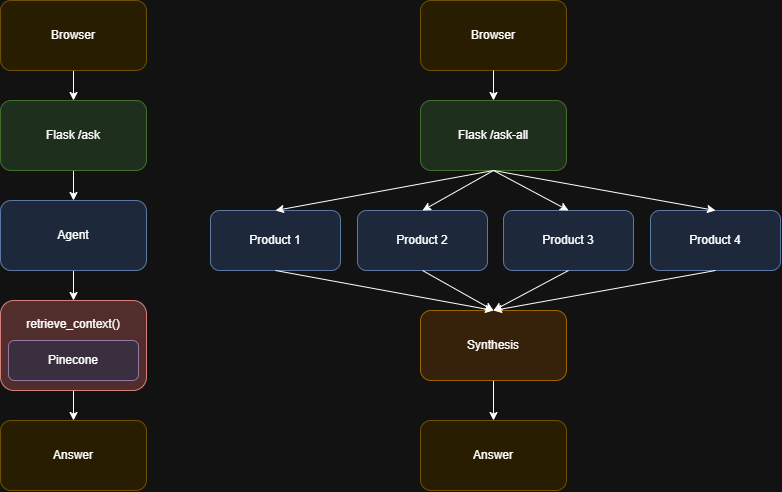

# AMA-Chatbot-Alle-Merken

A Flask-based chatbot with RAG infrastructure that answers questions about the mortgage acceptance
policies of four Achmea Bank mortgage brands. It can answer for a single brand, or
compare answers across all four brands at once.

## What it does

- The app retrieves relevant passages from that brand's policy PDF and answers with
  citations to the exact page numbers used.
- Users can also ask one question across all brands at once. Each brand answers
  independently, and the results are synthesized into a comparison



## Tech Stack

| Layer | Technology |
|---|---|
| Web framework | Flask + Gunicorn |
| LLM | OpenAI `gpt-4.1` (via LangChain) |
| Embeddings | OpenAI `text-embedding-3-large` |
| Vector store | Pinecone (serverless) |
| Agent framework | LangGraph (`create_react_agent`, ReAct pattern) |
| PDF ingestion | `PyPDFLoader` + `RecursiveCharacterTextSplitter` |

https://www.langchain.com/

https://flask.palletsprojects.com/en/stable/

https://www.pinecone.io/

## Project Structure

app.py - Flask app, agent orchestration, API routes

ingest.py - One-off script to embed brand PDFs into Pinecone

brands.py - Brand config: names, colors, PDF paths

requirements.txt - Python dependencies

Dockerfile - Container build (gunicorn entrypoint)

templates/ - HTML template(s) for the chat UI

static/ - JS, CSS, brand PDFs


## Setup

### Requirements
- Python 3.11
- An OpenAI API key
- A Pinecone API key

API keys are currently managed by Guido Hendrix. 

### Pinecone

**Note:** the existing `hypotheek-docs` Pinecone index is already populated with all
four brands' PDFs — you do **not** need to run this step for normal local development
or testing. Only run it if:
- you're connecting to a **new/empty Pinecone project** (different API key than the
  one currently in use), or
- a brand's **PDF has changed** (updated policy) and needs to be re-embedded, or
- a **new brand** is being added (see "Adding a New Brand" below)

If one of those applies, place the brand's PDF under `static/pdfs/` (path must match
`brands.py`), then run:

```bash
python ingest.py
```

This creates the `hypotheek-docs` Pinecone index (if it doesn't already exist) and
embeds every brand's PDF, tagging each chunk with its brand.


## Deployment

**Current:** This app runs on [Render](https://render.com) as a Docker-based web
service, built directly from this repo's `Dockerfile`
Current access to the Render dashboard and API keys is held by Guido Hendrikx.

### Development plan 

To be updated... 

### Migration plan and further development

To be updated... 

## Adding a New Brand

1. Add the PDF to `static/pdfs/`.
2. Add an entry to `BRANDS` in `brands.py` (name, colors, icon, `pdf_url`).
3. Re-run `python ingest.py` to embed the new PDF.
4. Restart the app. 

## Documentation

For a deeper dive into the RAG pipeline, the ReAct agent loop, the multi-brand
comparison flow, and known production risks, see [`ARCHITECTURE.md`](./ARCHITECTURE.md).
